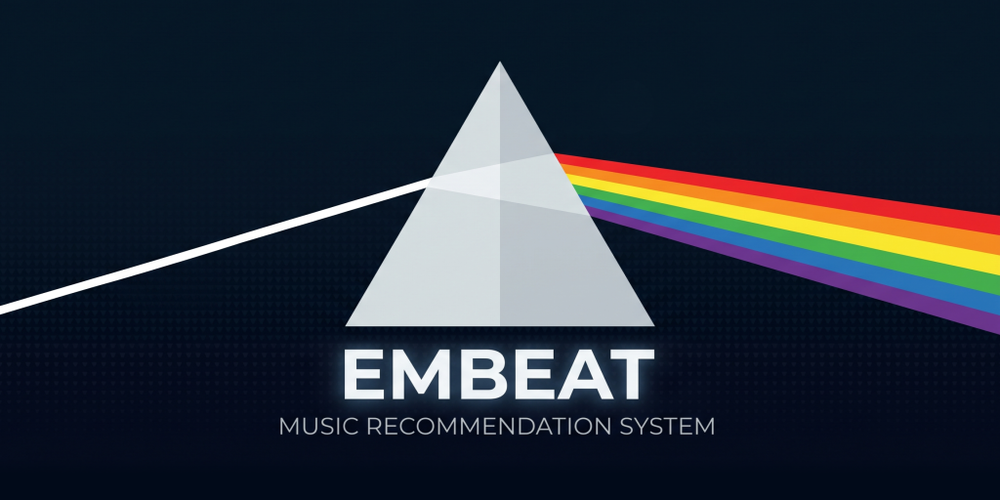
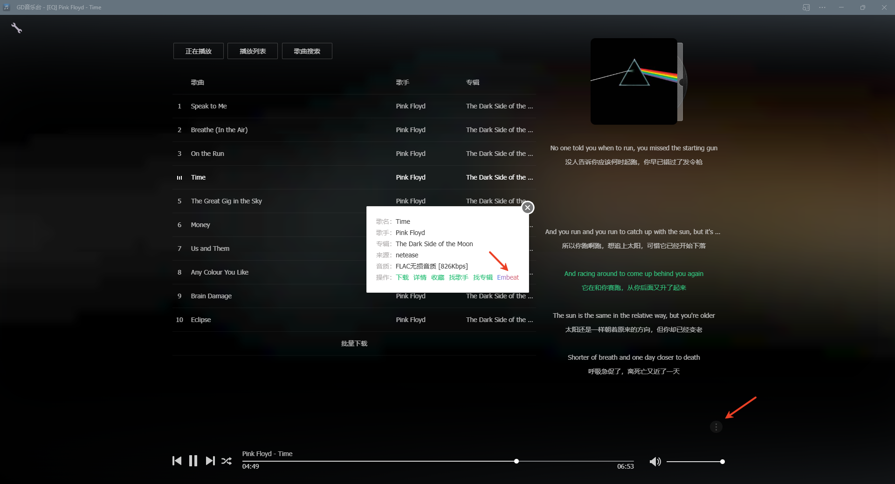

<p align="center">
  
</p>

<p align="center">
  <b>Embeat - 基于声学特征的音乐推荐系统</b>
</p>

<p align="center">
  <a href="README.md">English</a> | <b>中文</b>
</p>

<p align="center">
  <a href="https://github.com/gdstudio-org/Embeat"></a>
  <a href="https://github.com/gdstudio-org/Embeat/blob/main/LICENSE"></a>
</p>

---

## 简介

Embeat 是一个基于 Spotify 声学特征数据构建的歌曲推荐系统，通过**对比学习模型**将音频特征编码为向量，结合**多路召回**策略实现高质量的音乐推荐。

核心特点：

- **声学相似**：基于 Spotify Audio Features（调性、节拍、能量、情绪等）训练的 EmbeatMLP 模型，将声学特征编码为 64 维向量
- **流派感知**：引入 6000+ 微流派标签，为 200 万+ 歌手精准分配流派，避免"声学相似但风格迥异"的推荐
- **多路召回**：5 路并行召回（声学相似 / 同流派热门 / 同歌手 / 相似歌手 / 歌单协同过滤），融合打分后输出
- **歌单协同过滤**：通过 Track2Vec（Word2Vec 思路）学习 188 万份 Spotify 歌单中歌曲的共现关系
- **毫秒级响应**：基于 Qdrant 向量数据库，4500 万首歌曲的检索响应在 30~100ms 内完成

## Roadmap

- [x] 2026-06-26：开源 初版代码 + [EmbeatMLP 模型权重](checkpoints/EmbeatMLP/)
- [x] 2026-06-26：开源 [45M 单曲数据集](https://huggingface.co/datasets/GD-Studio/embeat_45m_spotify_tracks) + [技术文档](https://www.bilibili.com/opus/1218087093501165591)
- [ ] 100 Star：开源 Qdrant 数据库
- [ ] 1K Star：开源 Track2Vec 模型权重 + 6.6M 歌单数据集

## 效果展示

以下是 Embeat 的推荐结果示例（种子曲目 -> Top 5 推荐歌曲）：

<details>
<summary><b>晴天 - Jay Chou [mandopop, taiwan pop, c-pop]</b></summary>

| # | 歌曲 | 歌手 | 来源 |
|---|------|------|------|
| 1 | 告白氣球 | Jay Chou | 同流派热门, 同歌手, 歌单协同 |
| 2 | 突然好想你 | Mayday | 同流派热门, 相似歌手 |
| 3 | 怎麼了 | Eric Chou | 同流派热门, 歌单协同 |
| 4 | 飞鸟和蝉 | Ren Ran | 歌单协同 |
| 5 | 你的背包 | Eason Chan | 相似歌手 |

</details>

<details>
<summary><b>Uptown Funk (feat. Bruno Mars) - Bruno Mars [dance pop, pop]</b></summary>

| # | 歌曲 | 歌手 | 来源 |
|---|------|------|------|
| 1 | That's What I Like | Bruno Mars | 同流派热门, 同歌手, 歌单协同 |
| 2 | Timber | Pitbull | 同流派热门, 歌单协同 |
| 3 | CAN'T STOP THE FEELING! | Justin Timberlake | 歌单协同 |
| 4 | Happy | Pharrell Williams | 歌单协同 |
| 5 | Sugar | Maroon 5 | 歌单协同 |

</details>

<details>
<summary><b>Sis puella magica! - 梶浦由記 [anime score, japanese vgm]</b></summary>

| # | 歌曲 | 歌手 | 来源 |
|---|------|------|------|
| 1 | Conturbatio | 梶浦 由記 | 同歌手, 歌单协同 |
| 2 | 輝く空の静寂には | Kalafina | 相似歌手 |
| 3 | Forbidden Love | Cécile Corbel | 声学相似 |
| 4 | ARIA | Kalafina | 相似歌手 |
| 5 | Zoltraak | Evan Call | 同流派热门 |

</details>

### LLM 盲评对比

<b>具体对比细节请阅读 [技术文档](https://www.bilibili.com/opus/1218087093501165591)</b>

使用 LLM-as-a-Judge 方法（GPT-5.5 / Gemini Flash 3.5 / Claude Sonnet 4.6），对 Embeat 与网易云音乐进行 AB 盲测：

| 评估模型 | Embeat 胜 | 网易云胜 | 平局 |
|---------|:---------:|:-------:|:----:|
| Claude Sonnet 4.6 | **8** | 2 | 0 |
| Gemini Flash 3.5 | **9** | 1 | 0 |
| GPT 5.5 | **6** | 4 | 0 |

## 系统架构

```
输入: track_id / track_name + artist_name
  │
  ├─ 第1路: 声学相似召回 (EmbeatMLP向量 + 流派过滤)
  ├─ 第2路: 同流派热门召回 (流派标签 + 热度排序)
  ├─ 第3路: 同歌手召回 (artist_idx + 热度排序)
  ├─ 第4路: 相似歌手召回 (Spotify Related Artists + 向量排序)
  ├─ 第5路: 歌单协同过滤 (Track2Vec)
  │
  ├─ ISRC去重 / 重排打分 / 同歌手比例控制
  │
  └─ 输出: Top-K 推荐列表
```

### 模型说明

**EmbeatMLP** - 声学特征编码模型

- 输入：离散特征（key, mode, tempo, time_signature）+ 连续特征（energy, valence, danceability 等 7 维）
- 架构：双塔 MLP（Discrete Tower + Acoustic Tower -> Backbone）
- 输出：64 维 L2 归一化向量
- 训练：Masked InfoNCE Loss，batch_size=4096，~70 steps 即可收敛
- 参数量极小，支持纯 CPU 实时推理

**Track2Vec** - 歌单协同过滤模型

- 基于 Word2Vec Skip-Gram，将歌单视为"句子"，歌曲视为"单词"
- 训练数据：188 万份 Spotify 歌单
- 词表：109 万首歌曲，64 维向量
- 单次查询耗时 < 0.1ms

## 快速开始

### 环境要求

- Python >= 3.10
- PyTorch >= 2.6, < 2.7（训练需要）
- CUDA >= 12.0（训练需要）
- [Qdrant](https://github.com/qdrant/qdrant/releases)（推理需要）

### 安装依赖

```bash
conda create -n embeat python=3.10
conda activate embeat

# 安装 PyTorch (CUDA 12.x)，参考 https://pytorch.org/get-started/locally/
pip install "torch>=2.6,<2.7" --index-url https://download.pytorch.org/whl/cu126

pip install -r requirements.txt
```

### 训练 EmbeatMLP

```bash
# 准备 HuggingFace Dataset 格式的训练数据，放到 data/datasets/ 目录下
python -m train.train \
    --dataset data/datasets/spotify_45m_tracks_metadata@10000000 \
    --batch-size 4096 \
    --max-steps 200 \
    --lr 1e-4 \
    --tau 0.05 \
    --ckpt-dir checkpoints
```

### 训练 Track2Vec

```bash
# 准备歌单训练数据 (txt格式，每行一个歌单，空格分隔track_id)
cd train
python train_track2vec.py
```

### 推理：计算两首歌的声学相似度

```python
from infer.infer import infer

song_a = {"key": 7, "mode": 1, "tempo": 137, "time_signature": 4,
          "danceability": 0.54, "energy": 0.56, "speechiness": 0.02,
          "instrumentalness": 0.0, "valence": 0.41, "acousticness": 0.23,
          "liveness": 0.1}

song_b = {"key": 5, "mode": 0, "tempo": 87, "time_signature": 4,
          "danceability": 0.67, "energy": 0.65, "speechiness": 0.05,
          "instrumentalness": 0.03, "valence": 0.57, "acousticness": 0.27,
          "liveness": 0.19}

similarity = infer(sample_a=song_a, sample_b=song_b,
                   checkpoint_path="checkpoints/EmbeatMLP/model.pt")
print(f"Similarity: {similarity:.4f}")
```

### 推理：基于 Qdrant 的歌曲推荐

```bash
# 1. 启动 Qdrant 服务并导入数据库
# 2. 通过命令行查询推荐
cd infer
python Embeat.py -t 5pIcwtJYNJx93l420oR2Vm   # 通过 Spotify Track ID 查询
python Embeat.py -s "晴天 - Jay Chou"   # 通过歌名和歌手查询
python Embeat.py -a "Jay Chou"   # 通过歌手名查询
```

## 项目结构

```
Embeat/
├── assets/                 # 资源文件
├── checkpoints/
│   ├── EmbeatMLP/          # EmbeatMLP 模型权重
│   └── Track2Vec/          # Track2Vec 模型权重 (需额外下载)
├── data/                   # 数据处理脚本（未完全整理）
├── infer/                  # 推理代码
│   ├── Embeat.py           # 推荐系统核心 (多路召回 + 重排)
│   ├── infer.py            # EmbeatMLP 推理入口
│   ├── hf_to_qdrant.py     # HuggingFace Dataset -> Qdrant 数据库
│   └── eval_infer.py       # 模型评估工具
├── train/                  # 训练代码
│   ├── model.py            # EmbeatMLP 模型定义
│   ├── dataset.py          # 数据集处理
│   ├── sampler.py          # 正负样本采样器
│   ├── loss.py             # Masked InfoNCE Loss
│   ├── trainer.py          # 训练器
│   ├── train.py            # EmbeatMLP 训练入口
│   └── train_track2vec.py  # Track2Vec 训练入口
├── requirements.txt
└── LICENSE
```

## 相关链接

<p align="center">
  
</p>

- GD音乐台（在线体验）：[https://music.gdstudio.xyz](https://music.gdstudio.xyz)
- B站：[https://space.bilibili.com/13715770](https://space.bilibili.com/13715770)
- TG群：[https://t.me/gdstudio_music](https://t.me/gdstudio_music)

## 特别鸣谢

- [Anna's Archive](https://annas-archive.org)
- [Every Noise at Once](https://everynoise.com)

## License

| 范围 | 协议 |
|------|------|
| 代码、模型权重 | [MIT](LICENSE-MIT) |
| 数据集、数据库 | [CC-BY-NC 4.0](LICENSE) |
